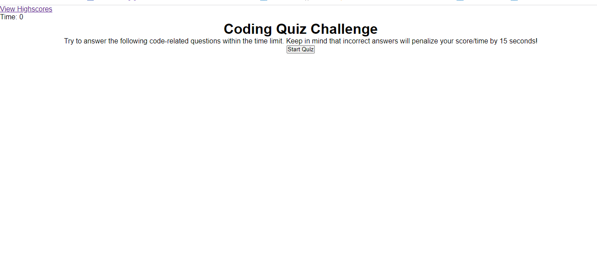

https://zainkhawaja98.github.io/challenge-4-javascript-quiz/
# challenge-4-javascript-quiz

## Description
The purpose of this website is to study questions related to javascript. It will keep track of the number of questions correct and will display your score so you can see how you rank among others or your previous attempts. I built this website so I have an interactive way of studying that will be more effective than flash cards or other studying methods. I learned how to create a timer that will decrease in time and how to create arrays. 

## Installation

N/A

## Usage
In order to use the website, press the start quiz button. A question will appear with 4 answers and the correct answer needs to be selected. An incorrect answer will still move on to the next question but will decrease the timer by 15 seconds. When all questions are answered or the timer runs out, the quiz will end and the user will input their initials in the highscore.

## Credits

N/A

## License

MIT License

Copyright (c) 2022 ZainKhawaja

Permission is hereby granted, free of charge, to any person obtaining a copy of this software and associated documentation files (the "Software"), to deal in the Software without restriction, including without limitation the rights to use, copy, modify, merge, publish, distribute, sublicense, and/or sell copies of the Software, and to permit persons to whom the Software is furnished to do so, subject to the following conditions:

The above copyright notice and this permission notice shall be included in all copies or substantial portions of the Software.

THE SOFTWARE IS PROVIDED "AS IS", WITHOUT WARRANTY OF ANY KIND, EXPRESS OR IMPLIED, INCLUDING BUT NOT LIMITED TO THE WARRANTIES OF MERCHANTABILITY, FITNESS FOR A PARTICULAR PURPOSE AND NONINFRINGEMENT. IN NO EVENT SHALL THE AUTHORS OR COPYRIGHT HOLDERS BE LIABLE FOR ANY CLAIM, DAMAGES OR OTHER LIABILITY, WHETHER IN AN ACTION OF CONTRACT, TORT OR OTHERWISE, ARISING FROM, OUT OF OR IN CONNECTION WITH THE SOFTWARE OR THE USE OR OTHER DEALINGS IN THE SOFTWARE.

---